# 🏗️ HydrogenAI Architecture Diagram

## 🎯 Complete Mermaid Architecture Flowchart

```mermaid
graph TB
    %% External Layer
    Client[🌐 Client Applications<br/>Web/API/Mobile]
    
    %% API Gateway Layer
    Kong[🚪 Kong API Gateway<br/>Port: 8080<br/>- Rate Limiting<br/>- CORS<br/>- Security<br/>- Monitoring]
    
    %% Core Services Layer
    Orchestrator[🎯 Orchestrator Service<br/>Port: 8000<br/>- AI Query Processing<br/>- Workflow Engine<br/>- Multi-Provider AI<br/>- WebSocket Support]
    
    MCPServer[🛠️ MCP Server<br/>Port: 8001<br/>- MongoDB Operations<br/>- RAG Pipeline<br/>- Plugin System<br/>- Tool Management]
    
    Shared[📚 Shared Services<br/>- AI Provider Manager<br/>- Response Cache<br/>- Config Validator<br/>- Common Models]
    
    %% Data Storage Layer
    MongoDB[(🗄️ MongoDB Atlas<br/>Primary Database<br/>29K+ Documents)]
    Qdrant[(🔍 Qdrant Vector DB<br/>Semantic Search<br/>Document Embeddings)]
    Redis[(⚡ Redis Cache<br/>Session Storage<br/>Response Cache)]
    
    %% Message Queue
    NATS[📡 NATS Event Bus<br/>Inter-Service<br/>Communication]
    
    %% External AI Services
    subgraph AIProviders[🤖 AI Providers]
        Groq[🚀 Groq<br/>Primary<br/>llama-3.1-8b-instant]
        OpenAI[🧠 OpenAI<br/>Fallback<br/>GPT Models]
        Anthropic[🎭 Anthropic<br/>Fallback<br/>Claude Models]
    end
    
    %% Plugin System
    subgraph PluginSystem[🔌 Plugin Ecosystem]
        MongoPlugin[📊 MongoDB Plugin<br/>Database Operations]
        RAGPlugin[📚 RAG Plugin<br/>Document Search]
        SystemPlugin[⚙️ System Plugin<br/>Health Monitoring]
        CustomPlugins[🛠️ Custom Plugins<br/>Extensible Tools]
    end
    
    %% Configuration Management
    subgraph ConfigSystem[⚙️ Configuration System]
        AgentConfig[🤖 Agent Configs<br/>default.yaml<br/>execution.yaml<br/>query_planning.yaml<br/>schema_discovery.yaml]
        ToolConfig[🛠️ Tool Configs<br/>mongodb.yaml<br/>rag.yaml]
        WorkflowConfig[🔄 Workflow Configs<br/>complex_aggregation.yaml<br/>rag_query.yaml<br/>simple_query.yaml]
    end
    
    %% Container Orchestration
    subgraph Kubernetes[☸️ Kubernetes Deployment]
        DevOverlay[🔧 Development Overlay<br/>Local Development<br/>CORS Enabled]
        ProdOverlay[🚀 Production Overlay<br/>HPA Scaling<br/>Resource Limits]
    end
    
    %% Client Connections
    Client -->|HTTPS/WSS| Kong
    
    %% Kong Gateway Routing
    Kong -->|/api/query| Orchestrator
    Kong -->|/api/health| Orchestrator
    Kong -->|/ws| Orchestrator
    Kong -->|/tools/execute| MCPServer
    Kong -->|/tools/list| MCPServer
    
    %% Core Service Communication
    Orchestrator -->|Tool Requests| MCPServer
    Orchestrator -->|AI Queries| AIProviders
    Orchestrator <-->|State Management| Redis
    Orchestrator <-->|Event Publishing| NATS
    Orchestrator -->|Common Services| Shared
    
    %% MCP Server Operations
    MCPServer -->|Database Ops| MongoDB
    MCPServer -->|Vector Ops| Qdrant
    MCPServer -->|Plugin Loading| PluginSystem
    MCPServer -->|Event Subscribe| NATS
    
    %% Shared Services Integration
    Shared -->|AI Calls| AIProviders
    Shared <-->|Caching| Redis
    Shared -->|Validation| ConfigSystem
    
    %% Plugin System Integration
    PluginSystem -->|MongoDB Tools| MongoDB
    PluginSystem -->|RAG Tools| Qdrant
    PluginSystem -->|System Tools| Redis
    
    %% Configuration Integration
    ConfigSystem -.->|Configure| Orchestrator
    ConfigSystem -.->|Configure| MCPServer
    ConfigSystem -.->|Configure| PluginSystem
    
    %% Container Orchestration
    Kubernetes -->|Manages| Kong
    Kubernetes -->|Manages| Orchestrator
    Kubernetes -->|Manages| MCPServer
    
    %% Styling
    classDef clientStyle fill:#e1f5fe,stroke:#01579b,stroke-width:2px
    classDef gatewayStyle fill:#f3e5f5,stroke:#4a148c,stroke-width:2px
    classDef serviceStyle fill:#e8f5e8,stroke:#1b5e20,stroke-width:2px
    classDef dataStyle fill:#fff3e0,stroke:#e65100,stroke-width:2px
    classDef aiStyle fill:#fce4ec,stroke:#880e4f,stroke-width:2px
    classDef pluginStyle fill:#f1f8e9,stroke:#33691e,stroke-width:2px
    classDef configStyle fill:#e0f2f1,stroke:#00695c,stroke-width:2px
    classDef k8sStyle fill:#e8eaf6,stroke:#1a237e,stroke-width:2px
    
    class Client clientStyle
    class Kong gatewayStyle
    class Orchestrator,MCPServer,Shared serviceStyle
    class MongoDB,Qdrant,Redis,NATS dataStyle
    class Groq,OpenAI,Anthropic aiStyle
    class MongoPlugin,RAGPlugin,SystemPlugin,CustomPlugins pluginStyle
    class AgentConfig,ToolConfig,WorkflowConfig configStyle
    class DevOverlay,ProdOverlay k8sStyle
```

## 🔄 Data Flow Sequence

## 🏗️ Component Architecture

```mermaid
graph LR
    subgraph "🎯 Orchestrator Service (3,626 lines)"
        OMain[main.py<br/>Core FastAPI App]
        OAgent[agents/<br/>AI Agent System]
        OCore[core/<br/>Infrastructure]
        OConfig[config.py<br/>Configuration]
        OQuery[query_classifier.py<br/>AI Classification]
        OWorkflow[workflow_engine.py<br/>Process Engine]
    end
    
    subgraph "🛠️ MCP Server"
        MMain[main.py<br/>FastAPI + Tools]
        MPlugin[plugin_manager.py<br/>Dynamic Loading]
        MTool[tool_registry.py<br/>Tool Management]
        MHealth[tools/health_tool.py<br/>Monitoring]
    end
    
    subgraph "📚 Shared Services"
        SAI[ai_provider_manager.py<br/>Multi-Provider AI]
        SCache[ai_cache.py<br/>Response Cache]
        SConfig[config_validator.py<br/>Validation]
        SModels[models.py<br/>Common Models]
        SUtils[utils.py<br/>Utilities]
    end
    
    OMain --> SAI
    OMain --> SCache
    OCore --> SModels
    MMain --> MTool
    MPlugin --> MHealth
    MTool --> SUtils
```

## 🔌 Plugin System Architecture

## 🌐 Network & Security Architecture

## 📊 Deployment & Scaling Architecture

```mermaid
graph TB
    subgraph "☸️ Kubernetes Cluster"
        subgraph "🔧 Development Namespace"
            DevIngress[Ingress Controller<br/>hydrogen-dev.local]
            DevServices[Services<br/>ClusterIP]
            DevPods[Pods<br/>Development Config]
        end
        
        subgraph "🚀 Production Namespace"
            ProdIngress[Ingress Controller<br/>Production Domain]
            ProdServices[Services<br/>LoadBalancer]
            ProdPods[Pods<br/>Production Config]
            HPA[Horizontal Pod Autoscaler<br/>CPU/Memory Based]
        end
        
        subgraph "📊 Monitoring Stack"
            Prometheus[Prometheus<br/>Metrics Collection]
            Grafana[Grafana<br/>Dashboards]
            AlertManager[Alert Manager<br/>Notifications]
        end
    end
    
    subgraph "🏗️ Infrastructure"
        ELB[External Load Balancer]
        Storage[Persistent Storage<br/>NFS/EBS]
        Secrets[Secret Management<br/>Vault/K8s Secrets]
    end
    
    ELB --> DevIngress
    ELB --> ProdIngress
    
    DevServices --> DevPods
    ProdServices --> ProdPods
    HPA --> ProdPods
    
    Prometheus --> DevPods
    Prometheus --> ProdPods
    Grafana --> Prometheus
    AlertManager --> Prometheus
    
    DevPods --> Storage
    ProdPods --> Storage
    DevPods --> Secrets
    ProdPods --> Secrets
```

---

## 📋 Architecture Summary

### 🎯 **Key Components**
- **Kong Gateway**: Single entry point with security and routing
- **Orchestrator**: AI-powered query processing engine (3,626 lines)
- **MCP Server**: MongoDB operations and RAG functionality
- **Shared Services**: Common functionality and AI provider management
- **Plugin System**: Extensible tool ecosystem (21 MongoDB tools)

### 🔄 **Communication Patterns**
- **Synchronous**: REST API calls between services
- **Asynchronous**: NATS event bus for coordination
- **Caching**: Redis for performance optimization
- **Real-time**: WebSocket support for live updates

### 📊 **Data Management**
- **Primary Storage**: MongoDB Atlas (29K+ documents)
- **Vector Storage**: Qdrant for semantic search
- **Cache Layer**: Redis for response caching
- **Configuration**: YAML-based centralized configuration

### 🚀 **Deployment Strategy**
- **Containerization**: Docker with multi-stage builds
- **Orchestration**: Kubernetes with Kustomize
- **Scaling**: Horizontal Pod Autoscaler
- **Monitoring**: Prometheus + Grafana + AlertManager

### 🔐 **Security Features**
- **API Gateway**: Kong with rate limiting and CORS
- **Authentication**: JWT and Basic Auth ready
- **Network**: Container network isolation
- **Secrets**: Kubernetes secret management

This architecture provides a robust, scalable, and maintainable foundation for the HydrogenAI enterprise AI data orchestration platform.
